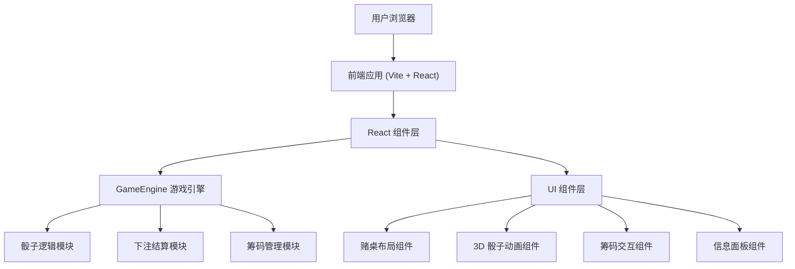

# 1. 架构设计



## 2. 技术选型说明

- **前端框架**：React 18 + TypeScript
- **构建工具**：Vite
- **样式方案**：纯 CSS + CSS Modules（不使用 Tailwind，以精确控制赌桌样式）
- **3D 动画**：Three.js / CSS 3D Transforms（骰盅动画）
- **状态管理**：React Context + useReducer
- **音效**：Web Audio API（可选，模拟赌场环境音效）

## 3. 路由定义

| 路由 | 用途 |
|------|------|
| / | 骰宝游戏主页面（单页应用，无多路由） |

## 4. 组件架构

```
src/
├── App.tsx                    # 主入口
├── main.tsx                   # 应用入口
├── styles/
│   ├── global.css             # 全局样式
│   ├── table.css              # 赌桌样式
│   ├── dice.css               # 骰子动画样式
│   └── chips.css              # 筹码样式
├── components/
│   ├── GameTable.tsx          # 赌桌主组件（包含所有下注区域）
│   ├── DiceShaker.tsx         # 骰盅组件（3D 动画）
│   ├── Dice.tsx               # 单个骰子组件
│   ├── BettingArea.tsx        # 下注区域组件
│   ├── ChipBar.tsx            # 筹码选择栏
│   ├── Chip.tsx               # 单个筹码组件
│   ├── InfoPanel.tsx          # 信息面板（余额、下注总额、结果）
│   ├── ResultOverlay.tsx      # 结果弹窗/覆盖层
│   ├── HistoryPanel.tsx       # 历史记录面板
│   └── PayoutTable.tsx        # 赔率表
├── engine/
│   ├── GameEngine.ts          # 游戏引擎核心逻辑
│   ├── DiceLogic.ts           # 骰子逻辑（随机生成、点数计算）
│   ├── BettingLogic.ts        # 下注逻辑（验证、结算、赔率计算）
│   └── ChipManager.ts         # 筹码管理
├── context/
│   └── GameContext.tsx         # 游戏状态管理
├── types/
│   └── index.ts               # TypeScript 类型定义
├── constants/
│   ├── betTypes.ts            # 下注类型定义
│   └── payouts.ts             # 赔率表
└── utils/
    ├── diceUtils.ts           # 骰子工具函数
    └── formatUtils.ts         # 格式化工具函数
```

## 5. 数据模型

### 5.1 核心类型定义

```typescript
// 骰子点数
type DiceValue = 1 | 2 | 3 | 4 | 5 | 6;

// 三颗骰子结果
interface DiceResult {
  dice: [DiceValue, DiceValue, DiceValue];
  sum: number;
  isTriple: boolean;    // 是否为围骰
  tripleValue?: number; // 围骰的数字
}

// 下注类型枚举
enum BetType {
  BIG = 'big',               // 大
  SMALL = 'small',           // 小
  ODD = 'odd',               // 单
  EVEN = 'even',             // 双
  SPECIFIC_SUM = 'sum',      // 指定点数总和
  DOUBLE = 'double',         // 双骰（对子）
  TRIPLE = 'triple',         // 围骰
  SPECIFIC_TRIPLE = 'specific_triple', // 指定围骰
  SINGLE_NUMBER = 'single',  // 单一数字
  COMBINATION = 'combination' // 组合
}

// 下注
interface Bet {
  id: string;
  type: BetType;
  amount: number;
  target?: number;      // 指定目标（如指定点数、指定数字）
  subTarget?: number[];  // 组合目标
}

// 游戏状态
interface GameState {
  balance: number;
  currentBets: Bet[];
  selectedChipValue: number;
  diceResult: DiceResult | null;
  phase: 'betting' | 'rolling' | 'result';
  lastResults: DiceResult[];
  winAmount: number;
  isProcessing: boolean;
}
```

### 5.2 赔率表
```typescript
const PAYOUTS = {
  BIG: 1,
  SMALL: 1,
  ODD: 1,
  EVEN: 1,
  SPECIFIC_SUM: {
    4: 50, 5: 30, 6: 18, 7: 12, 8: 8, 9: 6,
    10: 6, 11: 6, 12: 6, 13: 8, 14: 12, 15: 18,
    16: 30, 17: 50
  },
  DOUBLE: 8,
  TRIPLE: 24,
  SPECIFIC_TRIPLE: 150,
  SINGLE_NUMBER: { ONE: 1, TWO: 2, THREE: 3 },
  COMBINATION: 5
};
```

## 6. 游戏流程

```
[下注阶段] 用户选择筹码 → 点击下注区域下注
    ↓
[开骰阶段] 用户点击"开骰" → 骰盅动画开始
    ↓
[结算阶段] 骰子停止 → 计算结果 → 更新余额
    ↓
[显示阶段] 显示赢家/输家 → 高亮中奖注项 → 清除下注
```

## 7. 关键技术实现

### 7.1 骰盅动画
- 使用 CSS 3D transforms 实现骰盅上下晃动动画
- 骰子使用 CSS 3D 翻转动画模拟滚动
- 动画时长约 2-3 秒

### 7.2 赌桌布局
- 使用 CSS Grid 精确布局下注区域
- 每个下注区域是一个独立的交互组件
- 下注金额显示在对应区域上
- 中奖区域高亮显示

### 7.3 筹码交互
- 筹码为圆形元素，带面值数字
- 点击筹码切换当前选中面值
- 选中筹码有放大/发光效果
- 点击下注区域自动扣除余额并添加下注